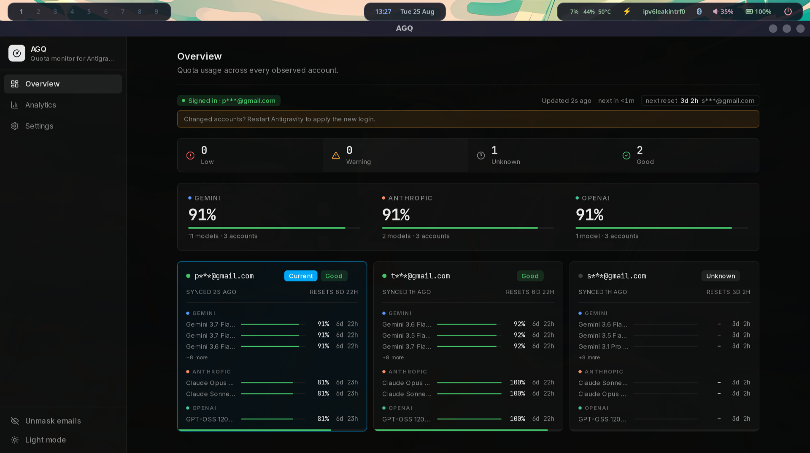
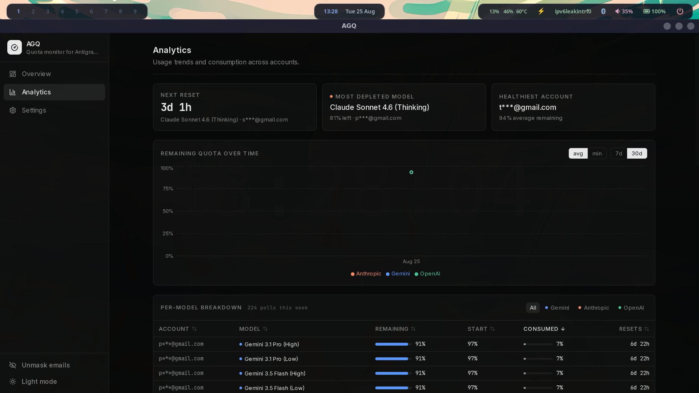
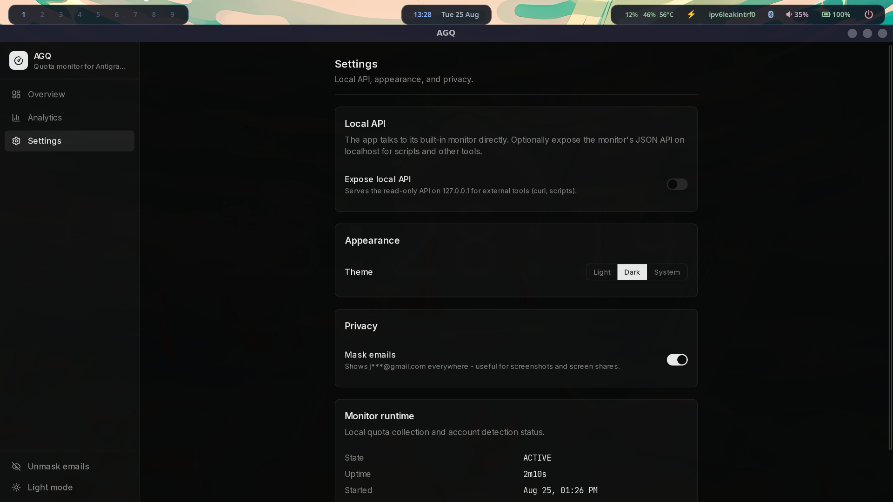

# AGQ

AGQ is a local-first desktop quota monitor for [Antigravity](https://antigravity.google). It discovers the local language server, records per-model quota snapshots, and presents live status, reset times, account history, and usage analytics.

AGQ is unofficial and local-only. It probes loopback services, uses the language server's CSRF token, and stores data in SQLite under `~/.agq`. It does not send telemetry or call a hosted AGQ service.

## Screenshots





## Features

- Per-model quota percentages, provider grouping, and reset countdowns
- Multiple-account history with live and idle state
- Seven-day and thirty-day analytics with per-model breakdowns
- Assumed-refill handling when a reset passes while AGQ is offline
- Inferred login timeline from snapshot history
- Optional email masking and opt-in loopback API exposure
- Wails desktop app for Linux and Windows
- Optional headless daemon for Linux servers and scripts

## Install

Download the latest artifacts from [GitHub Releases](https://github.com/NWGKGIT/AGQ/releases).

### Linux

```sh
chmod +x AGQ-x86_64.AppImage
./AGQ-x86_64.AppImage
```

AppImages use the host's FUSE integration when mounted. If your distribution
does not provide `libfuse.so.2`, run the AppImage with
`APPIMAGE_EXTRACT_AND_RUN=1`.

### Windows

Download the Windows x64 ZIP, extract it, and run `AGQ.exe`.

## Build From Source

Requirements: Go 1.26+, Node.js 24+, Wails v2.13.0, and platform webview dependencies. Linux builds require GTK3 and WebKitGTK 4.1. Windows builds require a supported Go and C compiler toolchain.

```sh
npm ci --prefix desktop/frontend
make desktop-build
```

Useful targets:

```sh
make desktop-dev       # Wails development mode
make desktop-test      # Desktop Go tests, frontend tests, and build
make desktop-appimage  # Linux x86_64 AppImage
make test              # Core Go tests
make docker-test       # Core tests in Docker
```

The standalone daemon is built with `make build` and listens on `localhost:${AGQ_PORT:-7432}`. Use `make install` and `make enable` to run it as a systemd user service.

## Data and Configuration

Runtime files live in `~/.agq`:

- `agq.db`: SQLite snapshot history
- `agq.log`: daemon log
- `desktop.json`: desktop settings

`AGQ_PORT` sets the local API port. The desktop app only exposes that API when enabled in Settings.

## Documentation

- [Architecture](docs/architecture.md)
- [Detection](docs/detection.md)
- [Data and logic](docs/data-and-logic.md)
- [JSON API](docs/api.md)
- [Frontend](docs/frontend.md)
- [Development and releases](docs/development.md)

## License and Disclaimer

AGQ is released under the [MIT License](LICENSE). It is not affiliated with Antigravity or any model provider.
